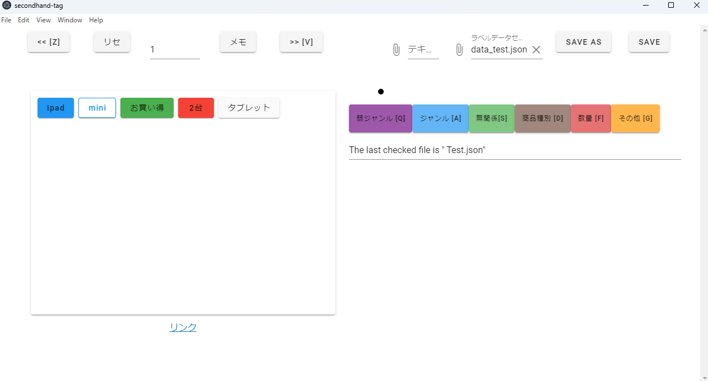

# SecondhandAnnotator
フリマサイト等，個人が出品できるサイトで
タイトルからルールベースでよさそうな商品を選ぶためのアノテーションツール．

特徴としては．
- タグは全テキスト共通であり，タグをつけた後，同じタグを持つテキストが現れた場合，自動でタグ付けされる．
- タグは複数単語にまたがってもよい．その際，2個目以降の単語は図のように前の色で縁取りされた白になる．
などがあります．

操作
- テキストのクリック          ... タグ付け，削除
- テキストのシフトクリック    ... すでに同じ色で色付けされている場合，一つ後ろの単語も同じタグに含める
- q, a, s, d, f, g             ... タグ切り替え
- z, v                      ... ページ切り替え

## 使用ライブラリ
npm, vue, vuetify, electron

## ビルド方法
`npm run electron:build`を実行してください，
